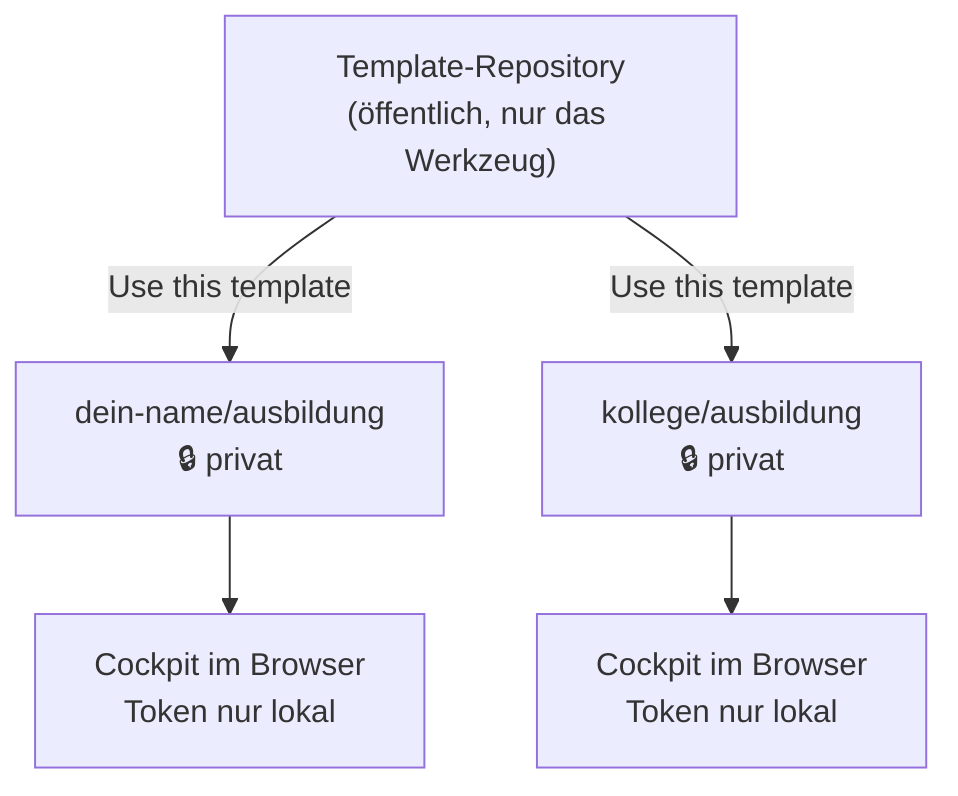

# Einrichtung in 5 Minuten

Ziel: dein eigenes, autarkes Ausbildungs-Cockpit — ohne Server, ohne fremde Cloud, ohne dass jemand anderes deine Berichte sieht.

---

## Wie das aufgebaut ist

Es gibt keinen zentralen Dienst. Jeder bekommt seine **eigene private Kopie**:



Das Template enthält **nur das Werkzeug**. Deine Inhalte entstehen in deiner Kopie und bleiben dort. Niemand — auch nicht der Autor des Templates — hat Zugriff darauf.

---

## Schritt 1 · Eigene Kopie anlegen (30 Sekunden)

1. Im Template-Repository oben auf **„Use this template" → „Create a new repository"**
2. Namen vergeben, z. B. `ausbildung`
3. **Sichtbarkeit: unbedingt `Private`**

> ⚠️ Ausbildungsnachweise beschreiben deinen Arbeitsalltag, oft mit Projekt- und Systemnamen. Selbst harmlos wirkende Einträge sind Betriebsinterna. Öffentlich gehört das nicht hin — und rückgängig machen lässt sich eine Veröffentlichung praktisch nicht.

Dann das Repository klonen, oder unter **Code → Download ZIP** herunterladen und entpacken.

---

## Schritt 2 · Starten (30 Sekunden)

```cmd
start_cockpit.cmd
```

Der Starter braucht **Python im `PATH`** (`python --version` muss etwas ausgeben). Er startet einen lokalen Server auf `http://localhost:8137`, wartet bis er antwortet, und öffnet den Browser im App-Modus.

Für eine Desktop-Verknüpfung einmalig `create_desktop_icon.bat` ausführen.

> **Nicht** `dropzone.html` doppelklicken. Über `file://` sperrt der Browser Ordner-Anbindung, Service Worker, dauerhaften Speicher und Zwischenablage-Zugriff gleichzeitig. Die Begründung steht in der [README](README.md#warum-ein-starter-und-kein-doppelklick).

Kein Windows? Jeder statische Server auf demselben Port tut es:

```bash
python3 -m http.server 8137 --bind 127.0.0.1
# dann http://localhost:8137/dropzone.html öffnen
```

---

## Schritt 3 · Assistent durchklicken (2 Minuten)

Beim ersten Start fragt ein kurzer Assistent ab:

| Schritt | Worum es geht |
|---|---|
| Beruf | bestimmt die Lernfelder im IHK-Navigator |
| Eckdaten | Ausbildungsbeginn, Prüfungstermine (werden vorgeschlagen), Betrieb |
| Arbeitszeit | 37 h, 38,5 h, 40 h oder individuell |
| Ablage | lokaler Ordner und / oder GitHub — beides optional |
| Ordner | die Reiter in Tab 1 |

Jeder Schritt ist überspringbar und später unter **⚙️ Einstellungen** änderbar.

---

## Schritt 4 · GitHub verbinden (optional, 2 Minuten)

Nur nötig, wenn du Dateien aus dem Cockpit heraus hochladen und Wochen im Repository archivieren willst. Ohne das funktioniert alles andere weiter.

1. GitHub → **Settings → Developer Settings → Personal access tokens → Fine-grained tokens → Generate new token**
2. **Repository access:** *Only select repositories* → dein eben angelegtes Repository
3. **Permissions → Repository permissions → Contents:** `Read and write`
4. Ablaufdatum wählen (ein Jahr ist üblich) und Token erzeugen
5. Token kopieren — GitHub zeigt ihn **nur einmal**
6. Im Cockpit: **⚙️ Einstellungen → GitHub** → Token und `dein-name/ausbildung` eintragen

Sobald beides steht, zeigt Tab 1 den Inhalt deiner Ordner. Fehlt ein Ordner noch im Repository, bekommt der Reiter einen gelben Punkt und einen **„Ordner anlegen"**-Knopf.

> **Zum Token:** Er liegt ausschließlich im Browser-Speicher deines Geräts und wird bewusst nicht in Datei-Backups geschrieben, damit er nicht über einen synchronisierten Ordner abfließt. Er gehört in kein Repository, in keine Datei und in keinen Chat.

---

## Schritt 5 · Lokalen Ordner verknüpfen (empfohlen)

**⚙️ Einstellungen → Lokal → Zielordner wählen**, dann einen Ordner in OneDrive, Nextcloud oder einem Obsidian-Vault auswählen.

Ab dann schreibt das Cockpit jede Woche als Markdown dorthin, dazu ein Vollbackup. Das ist die Sicherung, die auch dann noch da ist, wenn der Browser-Speicher durch eine Unternehmensrichtlinie geleert wird.

---

## Anpassen

Alles davon ist optional — das Cockpit läuft auch unverändert.

**Ordner-Reiter.** **⚙️ Einstellungen → Ordner** oder das **+** am Ende der Reiterleiste. Name, Zielpfad und optional eine Rolle pro Reiter.

**Eigener Ausbildungsberuf.** `BERUF_PRESETS` in `dropzone.html` — Beispiel steht in der [README](README.md#eigenen-beruf-ergänzen).

**Zeichenlimits.** Wenn dein Berichtsheft-Portal andere Feldgrenzen hat als 1.000 / 2.000 Zeichen: **⚙️ Einstellungen → Ausbildung**.

**KI-Prompt.** Die Funktion `buildCopilotPrompt()` in `dropzone.html` erzeugt den Text, den du in deine KI-Assistenz kopierst. Beruf, Sollstunden und Fachgebiete setzt sie aus deiner Konfiguration ein; die Anweisung zur Anonymisierung steht fest drin.

**Eigene Terminal-Schnipsel.** Im Terminal-Modal (Tab 1) lassen sich häufig gebrauchte Befehle hinterlegen.

---

## Vor dem ersten Commit prüfen

- [ ] Repository steht auf **Private**
- [ ] Kein Token in einer Datei — er gehört nur ins Einstellungsfeld
- [ ] Screenshots vor dem Einfügen im Snipping-Tool auf Namen, Kundendaten und Vertraulichkeitsvermerke prüfen
- [ ] Keine internen Hostnamen, IP-Adressen oder Kundennamen in Aufgabentexten — immer abstrahieren („Konfiguration eines internen Proxyservers")

Die letzten beiden Punkte sind kein Formalismus: ein Ausbildungsnachweis wandert zur IHK und zum Ausbilder.
